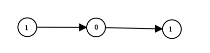

# 1290. Convert Binary Number in a Linked List to Integer

Acceptance: 0.8270000000000001
Difficulty: Easy
Frequency: 0.3638
Skills: Linked List, Math, binary number, bit manipulation
Solved: January 25, 2022
다시풀기: Required

# Description

Given `head` which is a reference node to a singly-linked list. The value of each node in the linked list is either `0` or `1`. The linked list holds the binary representation of a number.

Return the *decimal value* of the number in the linked list.

**Example 1:**



```
Input: head = [1,0,1]
Output: 5
Explanation: (101) in base 2 = (5) in base 10
```

**Example 2:**

```
Input: head = [0]
Output: 0
```

**Constraints:**

- The Linked List is not empty.
- Number of nodes will not exceed `30`.
- Each node's value is either `0` or `1`.

# Solutions

### Python

```python
# Definition for singly-linked list.
# class ListNode:
#     def __init__(self, val=0, next=None):
#         self.val = val
#         self.next = next
class Solution:
    def getDecimalValue(self, head: ListNode) -> int:
        str_bin = ""
        node = head
        while node != None:
            str_bin += str(node.val)
            node = node.next

        num_base10 = 0
        for i in range(len(str_bin)):
            num_base10 += int(str_bin[i]) * 2**(len(str_bin)-1-i)
        return num_base10
```

> Runtime: 43 ms, faster than 30.12% of Python3 online submissions for Convert Binary Number in a Linked List to Integer.
> Memory Usage: 14.1 MB, less than 88.75% of Python3 online submissions for Convert Binary Number in a Linked List to Integer.

# Complexity Analysis

- Time complexity : O(N + N^2), where N is the length of Linked List.
- Space complexity : *O*(_n_), where n is the length of Linked List. 문자열 str_bin을 사용하기 때문.
  ⇒ Overall complexity가 너무 안좋다. 해설을 참고하자.

# 해설

해설 참고자료

[Convert Binary Number in a Linked List to Integer - LeetCode](https://leetcode.com/problems/convert-binary-number-in-a-linked-list-to-integer/solution/)

## Approach1 : Binary Representation

101(2) = 1 _ 2^2 + 0 _ 2^1 + 1*2^0 = ((1 * 2 + 0) \* 2) +1

인수분해 해보면 앞자리 \* 2 + 뒷자리를 반복적으로 더하면 10진수가 된다.

```python
# Definition for singly-linked list.
# class ListNode:
#     def __init__(self, val=0, next=None):
#         self.val = val
#         self.next = next
class Solution:
    def getDecimalValue(self, head: ListNode) -> int:
        num = head.val
        while head.next:
            num = num * 2 + head.next.val
            head = head.next
        return num
```

## Approach2 : Bit manipulation

<< bit operator를 사용하여 바로바로 더할 수 있다. 예를들어, 첫 자리부터 << 하면 말그대로 2진수 자리가 이동되고, | operator를 이용해 그 뒷자리와 더할 수 있다.

```python
# Definition for singly-linked list.
# class ListNode:
#     def __init__(self, val=0, next=None):
#         self.val = val
#         self.next = next
class Solution:
    def getDecimalValue(self, head: ListNode) -> int:
        num = head.val
        while head.next:
            num = (num << 1) | head.next.val
            head = head.next
        return num
```
