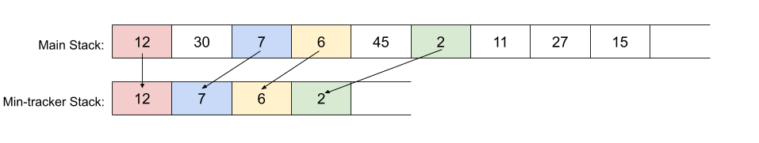

# 155. Min Stack

Acceptance: 50.4%
Difficulty: Easy
Frequency: 58.70%
Skills: Design, Stack
Solved: May 23, 2022

# Description

Design a stack that supports push, pop, top, and retrieving the minimum element in constant time.

Implement the `MinStack` class:

- `MinStack()` initializes the stack object.
- `void push(int val)` pushes the element `val` onto the stack.
- `void pop()` removes the element on the top of the stack.
- `int top()` gets the top element of the stack.
- `int getMin()` retrieves the minimum element in the stack.

**Example 1:**

```
Input
["MinStack","push","push","push","getMin","pop","top","getMin"]
[[],[-2],[0],[-3],[],[],[],[]]

Output
[null,null,null,null,-3,null,0,-2]

Explanation
MinStack minStack = new MinStack();
minStack.push(-2);
minStack.push(0);
minStack.push(-3);
minStack.getMin(); // return -3
minStack.pop();
minStack.top();    // return 0
minStack.getMin(); // return -2

```

**Constraints:**

- `231 <= val <= 231 - 1`
- Methods `pop`, `top` and `getMin` operations will always be called on **non-empty** stacks.
- At most `3 * 104` calls will be made to `push`, `pop`, `top`, and `getMin`.

# Solutions

### Python

Using tuple and store data with (val, current minimum)

```python
class MinStack:

    def __init__(self):
        self.stack = []

    def push(self, val: int) -> None:
        if not self.stack:
            self.stack.append((val,val))
            return

        current_min = self.stack[-1][1]
        self.stack.append((val, min(val, current_min)))

    def pop(self) -> None:
        self.stack.pop()

    def top(self) -> int:
        return self.stack[-1][0]


    def getMin(self) -> int:
        return self.stack[-1][1]

# Your MinStack object will be instantiated and called as such:
# obj = MinStack()
# obj.push(val)
# obj.pop()
# param_3 = obj.top()
# param_4 = obj.getMin()
```

> Runtime: 90 ms, faster than 49.96% of Python3 online submissions for Min Stack.
> Memory Usage: 18.4 MB, less than 24.12% of Python3 online submissions for Min Stack.

### Complexity Analysis

- Time complexity : O(1) for all operations
- Space complexity : O(n), in the worst case, all operations are push. There will be O(2n) = O(n)

### Python

Using two stacks (one for data, one for keeping track of minimum values)



```python
class MinStack:

    def __init__(self):
        self.stack = []
        # This is to keep track of minimum
        self.min_stack = []

    def push(self, val: int) -> None:
        self.stack.append(val)
        if not self.min_stack or self.min_stack[-1] >= val:
            self.min_stack.append(val)

    def pop(self) -> None:
        if self.stack[-1] == self.min_stack[-1]:
            self.min_stack.pop()
        self.stack.pop()

    def top(self) -> int:
        return self.stack[-1]

    def getMin(self) -> int:
        return self.min_stack[-1]

# Your MinStack object will be instantiated and called as such:
# obj = MinStack()
# obj.push(val)
# obj.pop()
# param_3 = obj.top()
# param_4 = obj.getMin()
```

> Runtime: 89 ms, faster than 50.87% of Python3 online submissions for Min Stack.
> Memory Usage: 17.8 MB, less than 94.05% of Python3 online submissions for Min Stack.

### Complexity Analysis

- Time complexity : O(1) for all operations
- Space complexity : O(n), in the worst case, all operations are push. There will be O(2n) = O(n)

# Base Idea (One line)

1. Keep track of minimum values while pushing or pop. using tuple or two stacks.

# Explanation

[Reference]

[Min Stack - LeetCode](https://leetcode.com/problems/min-stack/solution/)
