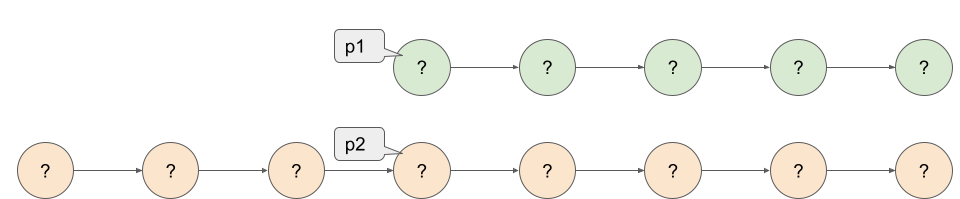

# 160. Intersection of Two Linked Lists

Acceptance: 50.2%
Difficulty: Easy
Frequency: 54.97%
Skills: Hash Table, Linked List, Two Pointers
Solved: May 23, 2022

# Description

Given the heads of two singly linked-lists `headA` and `headB`, return *the node at which the two lists intersect*. If the two linked lists have no intersection at all, return `null`.

For example, the following two linked lists begin to intersect at node `c1`:


The test cases are generated such that there are no cycles anywhere in the entire linked structure.

**Note** that the linked lists must **retain their original structure** after the function returns.

**Custom Judge:**

The inputs to the **judge** are given as follows (your program is **not** given these inputs):

- `intersectVal` - The value of the node where the intersection occurs. This is `0` if there is no intersected node.
- `listA` - The first linked list.
- `listB` - The second linked list.
- `skipA` - The number of nodes to skip ahead in `listA` (starting from the head) to get to the intersected node.
- `skipB` - The number of nodes to skip ahead in `listB` (starting from the head) to get to the intersected node.

The judge will then create the linked structure based on these inputs and pass the two heads, `headA` and `headB` to your program. If you correctly return the intersected node, then your solution will be **accepted**.

**Example 1:**


```
Input: intersectVal = 8, listA = [4,1,8,4,5], listB = [5,6,1,8,4,5], skipA = 2, skipB = 3
Output: Intersected at '8'
Explanation: The intersected node's value is 8 (note that this must not be 0 if the two lists intersect).
From the head of A, it reads as [4,1,8,4,5]. From the head of B, it reads as [5,6,1,8,4,5]. There are 2 nodes before the intersected node in A; There are 3 nodes before the intersected node in B.

```

**Example 2:**


```
Input: intersectVal = 2, listA = [1,9,1,2,4], listB = [3,2,4], skipA = 3, skipB = 1
Output: Intersected at '2'
Explanation: The intersected node's value is 2 (note that this must not be 0 if the two lists intersect).
From the head of A, it reads as [1,9,1,2,4]. From the head of B, it reads as [3,2,4]. There are 3 nodes before the intersected node in A; There are 1 node before the intersected node in B.

```

**Example 3:**


```
Input: intersectVal = 0, listA = [2,6,4], listB = [1,5], skipA = 3, skipB = 2
Output: No intersection
Explanation: From the head of A, it reads as [2,6,4]. From the head of B, it reads as [1,5]. Since the two lists do not intersect, intersectVal must be 0, while skipA and skipB can be arbitrary values.
Explanation: The two lists do not intersect, so return null.

```

**Constraints:**

- The number of nodes of `listA` is in the `m`.
- The number of nodes of `listB` is in the `n`.
- `1 <= m, n <= 3 * 104`
- `1 <= Node.val <= 105`
- `0 <= skipA < m`
- `0 <= skipB < n`
- `intersectVal` is `0` if `listA` and `listB` do not intersect.
- `intersectVal == listA[skipA] == listB[skipB]` if `listA` and `listB` intersect.

**Follow up:**

Could you write a solution that runs in O(m + n) time and use only O(1) memory?

# Solutions

### Python

Brute Force

```python
# Definition for singly-linked list.
# class ListNode:
#     def __init__(self, x):
#         self.val = x
#         self.next = None

class Solution:
    def getIntersectionNode(self, headA: ListNode, headB: ListNode) -> Optional[ListNode]:
        p1 = headA
        p2 = headB
        while p1:
            while p2:
                if p1 == p2:
                    return p1
                p2 = p2.next
            p1 = p1.next
            p2 = headB

        return None
```

Runtime Exceed

### Python

Hash Table

```python
# Definition for singly-linked list.
# class ListNode:
#     def __init__(self, x):
#         self.val = x
#         self.next = None

class Solution:
    def getIntersectionNode(self, headA: ListNode, headB: ListNode) -> Optional[ListNode]:
        p1 = headA
        p2 = headB
        hash = {}
        while p1:
            hash[p1] = 1
            p1 = p1.next
        while p2:
            if p2 in hash:
                return p2
            p2 = p2.next

        return None
```

> Runtime: 268 ms, faster than 18.72% of Python3 online submissions for Intersection of Two Linked Lists.
> Memory Usage: 29.8 MB, less than 27.62% of Python3 online submissions for Intersection of Two Linked Lists.

### Complexity Analysis

- Time complexity : O(m+n)
- Space complexity : O(max(m,n))

### Python

Two Pointers



1. Calculate *N*; the length of list A.
2. Calculate *M*; the length of list B.
3. Set the start pointer for the *longer* list.
4. Step the pointers through the list together.

```python
# Definition for singly-linked list.
# class ListNode:
#     def __init__(self, x):
#         self.val = x
#         self.next = None

class Solution:
    def getIntersectionNode(self, headA: ListNode, headB: ListNode) -> Optional[ListNode]:
        p1 = headA
        p2 = headB
        while p1!=p2:
            p1 = headB if p1 is None else p1.next
            p2 = headA if p2 is None else p2.next

        return p1
```

Runtime: 270 ms, faster than 18.03% of Python3 online submissions for Intersection of Two Linked Lists.
Memory Usage: 29.7 MB, less than 48.68% of Python3 online submissions for Intersection of Two Linked Lists.

### Complexity Analysis

- Time complexity : O(m+n)
- Space complexity : O(1)

# Base Idea (One line)

1. Hash Table
2. Two Pointers. the "tails" must be the same length, we can conclude that *if*
    there is an intersection, then the intersection node will be one of shorter list nodes.

# Explanation

[Reference]

[Intersection of Two Linked Lists - LeetCode](https://leetcode.com/problems/intersection-of-two-linked-lists/solution/)
