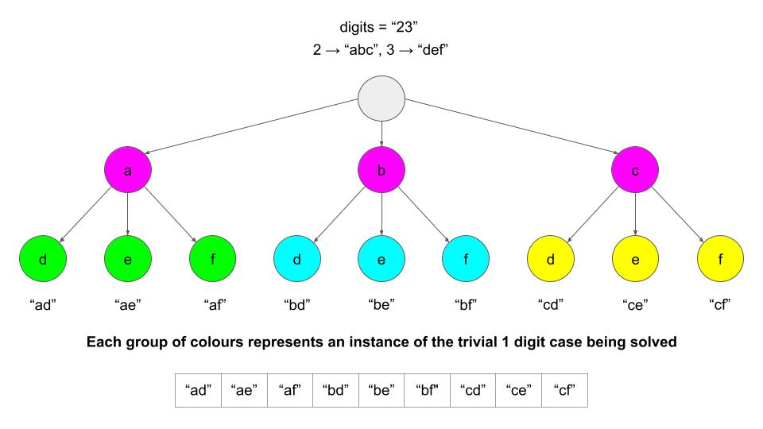

# 17. Letter Combinations of a Phone Number

Acceptance: 54.4%
Difficulty: Medium
Frequency: 86.74%
Skills: Backtracking, Hash Table, String
Solved: June 1, 2022

# Description

Given a string containing digits from `2-9` inclusive, return all possible letter combinations that the number could represent. Return the answer in **any order**.

A mapping of digit to letters (just like on the telephone buttons) is given below. Note that 1 does not map to any letters.


**Example 1:**

```
Input: digits = "23"
Output: ["ad","ae","af","bd","be","bf","cd","ce","cf"]

```

**Example 2:**

```
Input: digits = ""
Output: []

```

**Example 3:**

```
Input: digits = "2"
Output: ["a","b","c"]

```

**Constraints:**

- `0 <= digits.length <= 4`
- `digits[i]` is a digit in the range `['2', '9']`.

# Solutions

### Python

BFS

```python
from collections import deque
class Solution:
    def letterCombinations(self, digits: str) -> List[str]:
        letters = {"1": [],
               "2": ["a","b","c"],
               "3": ["d","e","f"],
               "4": ["g","h","i"],
               "5": ["j","k","l"],
               "6": ["m","n","o"],
               "7": ["p","q","r","s"],
               "8": ["t","u","v"],
               "9": ["w","x","y","z"]}
        if digits == "":
            return []

        q = deque(letters[digits[0]])
        for i in range(1, len(digits)):
            len_q = len(q)
            while len_q:
                out = q.popleft()
                for ch in letters[digits[i]]:
                    q.append(out + ch)
                len_q -= 1
        return q
```

> Runtime: 52 ms, faster than 24.86% of Python3 online submissions for Letter Combinations of a Phone Number.
> Memory Usage: 13.9 MB, less than 77.84% of Python3 online submissions for Letter Combinations of a Phone Number.

### Complexity Analysis

- Time complexity : O(4^N \* N), where N is the length of digits. Note that 4 is referring to the maximum value length in the hash map, and not to the length of the input.
  (N은 path를 combinations에 copy하는데 소요, 4^N은 decision space 최대 depth까지 가는데 소요)
- Space complexity : O(1), We don’t count the space used for the output. Hash map does not grow as the input grows.

### Python

Use a standard Backtracking algorithm (with recursion)

1. If the input is empty, return an empty array.
2. Initialize a data structure (e.g. a hash map) that maps digits to their letters, for example, mapping "6" to "m", "n", and "o".
3. Use a backtracking function to generate all possible combinations.
   - The function should take 2 primary inputs: the current combination of letters we have, `path`, and the `index` we are currently checking.
   - As a base case, if our current combination of letters is the same length as the input `digits`, that means we have a complete combination. Therefore, add it to our answer, and backtrack.
   - Otherwise, get all the letters that correspond with the current digit we are looking at, `digits[index]`.
   - Loop through these letters. For each letter, add the letter to our current `path`, and call `backtrack` again, but move on to the next digit by incrementing `index` by 1.
   - Make sure to remove the letter from `path` once finished with it.

```python
class Solution:
    def letterCombinations(self, digits: str) -> List[str]:
        # If the input is empty, immediately return an empty answer array
        if len(digits) == 0:
            return []

        # Map all the digits to their corresponding letters
        letters = {"2": "abc", "3": "def", "4": "ghi", "5": "jkl",
                   "6": "mno", "7": "pqrs", "8": "tuv", "9": "wxyz"}

        def backtrack(index, path):
            if index >= len(digits):
                combinations.append("".join(path))
                return #Backtrack

            chars = letters[digits[index]]

            for ch in chars:
                path.append(ch) # path + ch
                backtrack(index + 1, path)
								# Backtrack by removing the letter before moving onto the next
                path.pop()

        combinations = []
        backtrack(0, [])
        return combinations
```

> Runtime: 27 ms, faster than 96.56% of Python3 online submissions for Letter Combinations of a Phone Number.
> Memory Usage: 13.9 MB, less than 29.54% of Python3 online submissions for Letter Combinations of a Phone Number.

### Complexity Analysis

- Time complexity : O(4^N \* N), where N is the length of digits. Note that 4 is referring to the maximum value length in the hash map, and not to the length of the input.
  (N은 path를 combinations에 copy하는데 소요, 4^N은 decision space 최대 depth까지 가는데 소요)
- Space complexity : O(N), Not counting space used for the output, the extra space we use relative to input size is the space occupied by the recursion call stack. It will only go as deep as the number of digits in the input since whenever we reach that depth, we backtrack.

# Base Idea (One line)

1. Backtracking
2. BFS

# Explanation

[Reference]



[Letter Combinations of a Phone Number - LeetCode](https://leetcode.com/problems/letter-combinations-of-a-phone-number/solution/)

[코딩테스트, 기초, 백트래킹 backtracking 소개](https://www.youtube.com/watch?v=Ar40zcPoKEI)

Backtrack에 대한 개념을 간략히 잘 소개하고 있다.

## Backtrack과 DP의 차이

DP: Problem을 subproblem으로 나누면서 overlapping 되는 value들은 memoization 기법을 이용.

Backtrack: Decision space를 펼쳐나가면서 더이상 보지 않아도 되는 경우 다시 위로 올라가 다른 경우의 수들을 봄.
