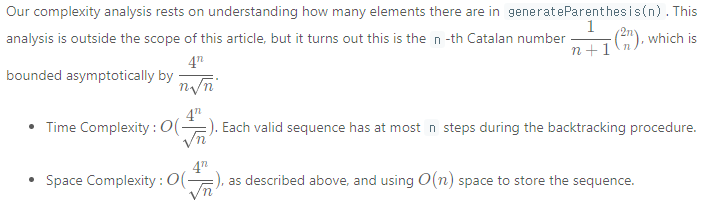

# 22. Generate Parentheses

Acceptance: 70.4%
Difficulty: Medium
Frequency: 87.37%
Skills: Backtracking, Dynamic Programming, String
Solved: June 3, 2022
다시풀기: Required

# Description

Given `n` pairs of parentheses, write a function to *generate all combinations of well-formed parentheses*.

**Example 1:**

```
Input: n = 3
Output: ["((()))","(()())","(())()","()(())","()()()"]

```

**Example 2:**

```
Input: n = 1
Output: ["()"]

```

**Constraints:**

- `1 <= n <= 8`

# Solutions

### Python

Brute Force (Recursion)

```python
class Solution:
    def generateParenthesis(self, n: int) -> List[str]:
        def generate(A = []):
				# recursively generate all cases that can be generated
            if len(A) == 2*n:
                if valid(A):
                    ans.append("".join(A))
            else:
                A.append("(")
                generate(A)
                A.pop()
                A.append(")")
                generate(A)
                A.pop()
        def valid(A):
            bal = 0
            for ch in A:
                if ch == '(': bal += 1
                else: bal -= 1

                # ')'이 '(' 보다 먼저 더 많이 나온 경우 바로 False
                if bal < 0:
                    return False
            return bal == 0

        ans = []
        generate()
        return ans
```

> Runtime:
> Memory Usage:

### Complexity Analysis

- Time Complexity : O(2^{2n}n). For each of 2^{2n} sequences, we need to create and validate the sequence, which takes O(n) work.
- Space Complexity : O(2^{2n}n). Naively, every sequence could be valid. See [Approach 3](https://leetcode.com/problems/generate-parentheses/solution/#approach-3-closure-number) for development of a tighter asymptotic bound.

### Python

Backtracking

```python
class Solution:
    def generateParenthesis(self, n: int) -> List[str]:
        ans = []

        def backtrack(S = [], left = 0, right = 0):
            if len(S) == 2*n:
                ans.append("".join(S))
                return

            if left < n:
                S.append("(")
                backtrack(S, left+1, right)
                S.pop()
            if right < left:
                S.append(")")
                backtrack(S, left, right+1)
                S.pop()

        backtrack()
        return ans
```

> Runtime: 56 ms, faster than 36.69% of Python3 online submissions for Generate Parentheses.
> Memory Usage: 14.2 MB, less than 76.65% of Python3 online submissions for Generate Parentheses.

### Complexity Analysis



# Base Idea (One line)

1. Backtracking

# Explanation

[Reference]

[Generate Parentheses - LeetCode](https://leetcode.com/problems/generate-parentheses/solution/)
