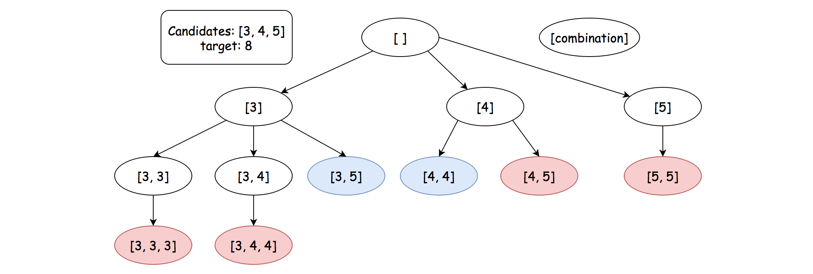

# 39. Combination Sum

Acceptance: 66.8%
Difficulty: Medium
Frequency: 72.78%
Skills: Array, Backtracking
Solved: August 8, 2022

# Description

Given an array of **distinct** integers `candidates` and a target integer `target`, return *a list of all **unique combinations** of* `candidates` *where the chosen numbers sum to* `target`*.* You may return the combinations in **any order**.

The **same** number may be chosen from `candidates` an **unlimited number of times**. Two combinations are unique if the frequency of at least one of the chosen numbers is different.

It is **guaranteed** that the number of unique combinations that sum up to `target` is less than `150` combinations for the given input.

**Example 1:**

```
Input: candidates = [2,3,6,7], target = 7
Output: [[2,2,3],[7]]
Explanation:
2 and 3 are candidates, and 2 + 2 + 3 = 7. Note that 2 can be used multiple times.
7 is a candidate, and 7 = 7.
These are the only two combinations.

```

**Example 2:**

```
Input: candidates = [2,3,5], target = 8
Output: [[2,2,2,2],[2,3,3],[3,5]]

```

**Example 3:**

```
Input: candidates = [2], target = 1
Output: []

```

**Constraints:**

- `1 <= candidates.length <= 30`
- `1 <= candidates[i] <= 200`
- All elements of `candidates` are **distinct**.
- `1 <= target <= 500`

# Solutions

### Python

```python
class Solution:
    def combinationSum(self, candidates: List[int], target: int) -> List[List[int]]:
        res = []
        def tracking(arr, target, start):
            if sum(arr) == target:
                # make a copy of the current combination
                res.append(list(arr))
                return
            elif sum(arr) > target:
                return

            for i in range(start, len(candidates)):
                arr.append(candidates[i])
                tracking(arr, target, i)
                # print(arr)
                arr.pop()

        tracking([], target,0)
        return res
```

> Runtime: 117 ms, faster than 62.81% of Python3 online submissions for Combination Sum.
> Memory Usage: 14.3 MB, less than 12.12% of Python3 online submissions for Combination Sum.

### Complexity Analysis

Let N*N* be the number of candidates, T*T* be the target value, and M*M* be the minimal value among the candidates.

- Time Complexity: \mathcal{O}(N^{\frac{T}{M}+1})O(_NMT_+1)
  - As we illustrated before, the execution of the backtracking is unfolded as a DFS traversal in a n-ary tree. The total number of steps during the backtracking would be the number of nodes in the tree.
  - At each node, it takes a constant time to process, except the leaf nodes which could take a linear time to make a copy of combination. So we can say that the time complexity is linear to the number of nodes of the execution tree.
  - Here we provide a *loose* upper bound on the number of nodes.
    - First of all, the fan-out of each node would be bounded to N*N*, *i.e.* the total number of candidates.
    - The maximal depth of the tree, would be \frac{T}{M}_MT_, where we keep on adding the smallest element to the combination.
    - As we know, the maximal number of nodes in N-ary tree of \frac{T}{M}*MT* height would be N^{\frac{T}{M}+1}_NMT_+1.
  - **Note that**, the actual number of nodes in the execution tree would be much smaller than the upper bound, since the fan-out of the nodes are decreasing level by level.
- Space Complexity: \mathcal{O}(\frac{T}{M})O(_MT_)
  - We implement the algorithm in recursion, which consumes some additional memory in the function call stack.
  - The number of recursive calls can pile up to \frac{T}{M}_MT_, where we keep on adding the smallest element to the combination. As a result, the space overhead of the recursion is \mathcal{O}(\frac{T}{M})O(_MT_).
  - In addition, we keep a combination of numbers during the execution, which requires at most \mathcal{O}(\frac{T}{M})O(_MT_) space as well.
  - To sum up, the total space complexity of the algorithm would be \mathcal{O}(\frac{T}{M})O(_MT_).
  - Note that, we did not take into the account the space used to hold the final results for the space complexity.

# Base Idea (One line)

1. Backtracking(comb, target, start). We don’t have to include elements that we already visited. [[refer here](source/39.png)]

# Explanation

[Reference]



[Combination Sum - LeetCode](https://leetcode.com/problems/combination-sum/solution/)
