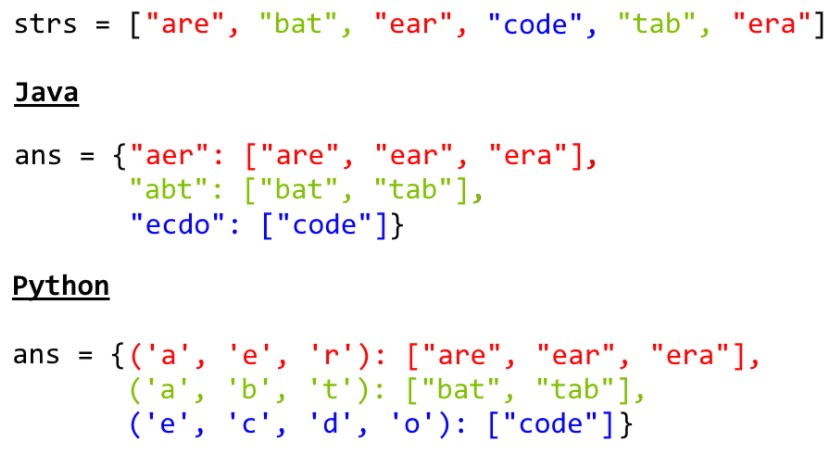

# 49. Group Anagrams

Acceptance: 0.639
Difficulty: Medium
Frequency: 0.8247
Skills: Hash Table, Sorting, String
Solved: April 8, 2022

# Description

Given an array of strings `strs`, group **the anagrams** together. You can return the answer in **any order**.

An **Anagram** is a word or phrase formed by rearranging the letters of a different word or phrase, typically using all the original letters exactly once.

**Example 1:**

```
Input: strs = ["eat","tea","tan","ate","nat","bat"]
Output: [["bat"],["nat","tan"],["ate","eat","tea"]]

```

**Example 2:**

```
Input: strs = [""]
Output: [[""]]

```

**Example 3:**

```
Input: strs = ["a"]
Output: [["a"]]

```

**Constraints:**

- `1 <= strs.length <= 104`
- `0 <= strs[i].length <= 100`
- `strs[i]` consists of lowercase English letters.

# Solutions

### Python

```python
class Solution:
    def groupAnagrams(self, strs: List[str]) -> List[List[str]]:
        dict = {}
        for str in strs:
            sorted_str = "".join(sorted(str))
            if sorted_str in dict:
                dict[sorted_str].append(str)
            else:
                dict[sorted_str] = [str]
        return list(dict.values())
```

> Runtime: 116 ms, faster than 77.68% of Python3 online submissions for Group Anagrams.
> Memory Usage: 17.1 MB, less than 96.65% of Python3 online submissions for Group Anagrams.

### Complexity Analysis

- Time complexity : O(N*K*logK), where N is the length of array strs, and K is the maximum length of a string in strs. The outer for loop takes O(N), then sorting a string takes O(KlogK).
- Space complexity : O(N\*K), the total answer is stored in dict.

# Base Idea (One line)

1. sorting each string and let them key of hash table and let strings value of key.



# Explanation

[Reference]

```python
class Solution(object):
    def groupAnagrams(self, strs):
        ans = collections.defaultdict(list)
        for s in strs:
            ans[tuple(sorted(s))].append(s)
        return ans.values()
```

[Another solution]

```python
class Solution:
    def groupAnagrams(strs):
        ans = collections.defaultdict(list)
        for s in strs:
            count = [0] * 26
            for c in s:
                count[ord(c) - ord('a')] += 1
            ans[tuple(count)].append(s)
        return ans.values()
```
