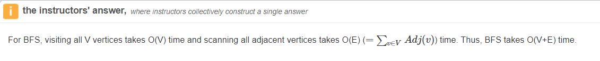

# 785. Is Graph Bipartite?

Acceptance: 0.499
Difficulty: Medium
Frequency: 0.32659999999999995
Skills: BFS, DFS, Graph, Union Find
Solved: January 29, 2022
다시풀기: Required

# Description

There is an **undirected** graph with `n` nodes, where each node is numbered between `0` and `n - 1`. You are given a 2D array `graph`, where `graph[u]` is an array of nodes that node `u` is adjacent to. More formally, for each `v` in `graph[u]`, there is an undirected edge between node `u` and node `v`. The graph has the following properties:

- There are no self-edges (`graph[u]` does not contain `u`).
- There are no parallel edges (`graph[u]` does not contain duplicate values).
- If `v` is in `graph[u]`, then `u` is in `graph[v]` (the graph is undirected).
- The graph may not be connected, meaning there may be two nodes `u` and `v` such that there is no path between them.

A graph is **bipartite** if the nodes can be partitioned into two independent sets `A` and `B` such that **every** edge in the graph connects a node in set `A` and a node in set `B`.

Return `true` \*if and only if it is **bipartite\***.

**Example 1:**


```
Input: graph = [[1,2,3],[0,2],[0,1,3],[0,2]]
Output: false
Explanation: There is no way to partition the nodes into two independent sets such that every edge connects a node in one and a node in the other.
```

**Example 2:**


```
Input: graph = [[1,3],[0,2],[1,3],[0,2]]
Output: true
Explanation: We can partition the nodes into two sets: {0, 2} and {1, 3}.
```

**Constraints:**

- `graph.length == n`
- `1 <= n <= 100`
- `0 <= graph[u].length < n`
- `0 <= graph[u][i] <= n - 1`
- `graph[u]` does not contain `u`.
- All the values of `graph[u]` are **unique**.
- If `graph[u]` contains `v`, then `graph[v]` contains `u`.

# Solutions

### Python

## 1차시도 - Wrong

```python
'''
try1
'''
class Solution:
    def isBipartite(self, graph: List[List[int]]) -> bool:
        #To be bipartite, there must not be any node which connects two nodes in one set.
        #To be BiPartite, there must be even levels.

        #two partition으로 나눌 때에 한 set내에 edge가 존재하면 안된다.
        #인접노드 정보들이 있으니 인접하지 않은 노드정보도 있는 것이다.
        #즉, 인접하지 않은 노드끼리 한 set로 묶고 두 세트 넘게 나오면 bipartition안되는 것.

        #When nodes are bipartited, the edge between two nodes in same set must not exist.
        #I know adjacet nodes, so I can guess non-adjacent nodes.
        #ie, make groups of non-adjacent nodes and if there are more than 2 groups, it cannot be bipartition.

        n = len(graph)
        arr_set = []

        for i in range(n):
            arr_temp = []
            for j in range(n):
                if j not in graph[i]:
                    arr_temp.append(j)
            if arr_temp not in arr_set:
                arr_set.append(arr_temp)
        print(arr_set)
        if len(arr_set) > 2:
            return False
        else:
            return True
```

##

```python
class Solution:
    def isBipartite(self, graph: List[List[int]]) -> bool:
        #DFS하면서 인접 노드들 간 서로 다른 색을 칠하고 DFS 끝날때까지 색깔 conflict가 발생하면 False, 발생하지 않으면 True 리턴.

        # DFS
        stack = []
        #visited = []
        # Color blue the first thing and red for adjacent nodes
        color = {}
        # repeat it
        n = len(graph)
        for i in range(n):
            #visited.append(i)
            #stack = [i]
            if i not in color: # if node is not visited,
                stack = [i]
                color[i] = 0 #blue , red : 1
                while stack:
                    node = stack.pop()
                    for nei in graph[node]:
                        if nei not in color:
                            stack.append(nei)
                            color[nei] = color[node] ^ 1
                        elif color[nei] == color[node]:
                            return False

    #                 if node not in visited:
    #                     stack.extend(graph[i])

    #                     if color[node] == 0: #blue
    #                         for j in range(len(graph[node])):
    #                             if color[graph[node][j]] == blue:
    #                                 return False
    #                             else:
    #                                 graph[node][j] = 1 #red
    #                     elif color[node] == 1: # red
    #                         for j in range(len(graph[node])):
    #                             if color[graph[node][j]] == red:
    #                                 return False
    #                             else:
    #                                 graph[node][j] = 0

        return True
```

> Runtime: 264 ms, faster than 35.58% of Python3 online submissions for Is Graph Bipartite?.
> Memory Usage: 14.3 MB, less than 99.53% of Python3 online submissions for Is Graph Bipartite?.

```python
class Solution:
    def isBipartite(self, graph: List[List[int]]) -> bool:
        stack = []
        color = {}

        for node in range(len(graph)):
            if node not in color:
                stack = [node]
                color[node] = 0 #blue
                while stack:
                    n = stack.pop()
                    for nei in graph[n]:
                        if nei not in color:
                            stack.append(nei)
                            color[nei] = color[n] ^ 1
                        elif color[nei] == color[n]:
                            return False
        return True
```

# Complexity Analysis

- Time Complexity: *O*(_N_+_E_), where *N* is the number of nodes in the graph, and *E* is the number of edges. **We explore each node once when we transform it from uncolored to colored, traversing all its edges in the process.**
- Space Complexity: *O*(_N_), the space used to store the `color`.

(FYI) For BFS, visiting all V vertices takes O(V) time and scanning all adjacent vertices takes O(E) (=∑v∈VAdj(v)) time. Thus, BFS takes O(V+E) time.



# 해설

해설 참고자료

[Is Graph Bipartite? - LeetCode](https://leetcode.com/problems/is-graph-bipartite/solution/)
